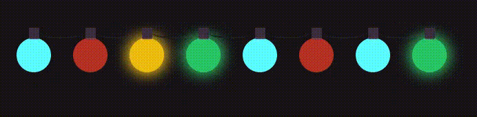

## [1 Day 1 Project](https://github.com/bugxvii/OneDay_OneProject) 

Day 9: Christmas Lights

## Description
Simulate a string of Christmas lights

The full description of the project can be found at [here](https://github.com/florinpop17/app-ideas/blob/master/Projects/1-Beginner/GitHub-Status-App.md).

## SPEC
- HTML 5
- CSS

## Reference
- https://codepen.io/irfanezani_/pen/mdeLpKo